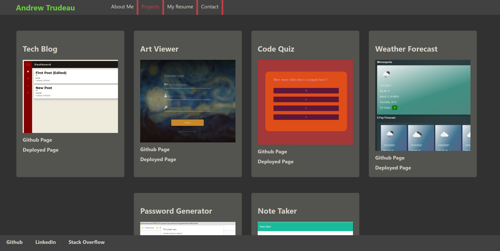

# 20 - React Portfolio

## Objective 

Create a web portfolio in React

## Changes

- Create React App
- Create Components (List in component folder)
- Add Components to App.js
- Style Using App.css

## Instructions & Usage

Using the deployed link, open the webpage and browse it.

## Screenshot

## Links

[Github](https://github.com/andrewtrudeau/20-React-Portfolio)

[Heroku](https://hw19-pwa-andrew-trudeau.herokuapp.com/)

## Contact

If you wish to reach me for questions, please refer to the contact information below:

Github Profile: [andrewtrudeau](https://github.com/andrewtrudeau)

Email Me: [andrewtrudeau3@gmail.com](mailto:andrewtrudeau3@gmail.com)